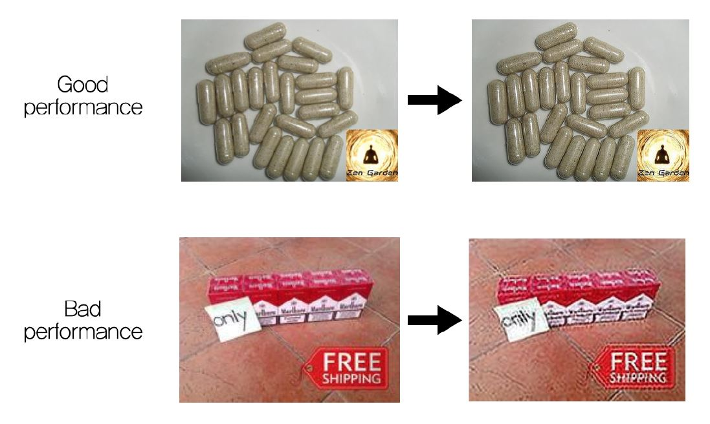
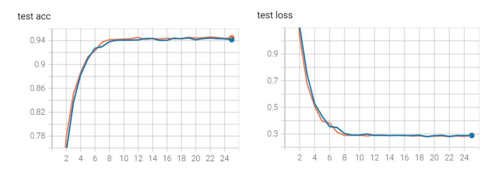

# 1. REFERENCES
1. WANG, Xiangwen, et al. You are your photographs: Detecting multiple identities of vendors in the darknet marketplaces. In: Proceedings of the 2018 on Asia Conference on Computer and Communications Security. 2018. p. 431-442.
2. DONG, Chao, et al. Image super-resolution using deep convolutional networks. IEEE transactions on pattern analysis and machine intelligence, 2015, 38.2: 295-307.
3. Resnet18 <https://tutorials.pytorch.kr/beginner/transfer_learning_tutorial.html>
4. Super Resolution Using CNN <https://github.com/yjn870/SRCNN-pytorch>

# 2. CONCEPT
Most of the drug images uploaded to the darknet market by vendors are of low quality, and contain text images such as watermarks that symbolize the vendor or drug names.  
Therefore, we thought that if we improve the image quality using Super-Resolution techniques and put the enhanced images into a machine learning model for classifying multiple accounts, the result of the classification will be improved and we will able to detect sybil accounts better. We will put the original dataset and the dataset to which Super-Resolution is applied into the DNN model respectively, and compare the classification results.

# 3. DATASET
We utilized the DNM data used in the previous paper, but we only used the 3-days data from the Silk Road2 because we didn’t need the whole datasets to analyze the result of the model.

* Entire data  
<https://archive.org/download/dnmarchives/silkroad2.tar.xz>
* SilkRoad2 for 3-days  
<https://drive.google.com/file/d/1lAyT54pkWKEVtEIr3MUIKwUFbFPgDCFt/view?usp=sharing>   
_Download this, unzip it and place it in your folder with the name 'DATASET_sample'._

Since the dataset in the DNM archive was in various formats such as png, base64 etc., we converted the dataset to jpg image format.
Next, we applied a Super-Resolution tool to the converted image dataset. In our experiment, we used a pre-trained SRCNN model(use srcnn_x2.pth).  
_Run the below command in the same folder where you place 'DATASET_sample'. This will create an 'image_collection' folder with about 20,000 jpg format images, and 'image_collection_sr' folder with results of Super-Resolution._

    python dnm_to_image.py
    python image_SR.py

Then we labeled the image dataset according to the user name, and if the user name was the same, it was regarded as the same vendor. For vendors that have more than 30 photos, we split their photos into two even parts. We add the first part to the training dataset and the second part to testing dataset. Also, for the other vendors, we add them to the training dataset.  
_Run the below command in the same folder. This will create an 'user_collection' folder and 'user_collection_sr' folder._

    python distribute_image.py
    python distribute_image_SR.py

# 4. MACHINE LEARNING
We tested the original dataset and Super-Resolution dataset using the RESNET18 model respectively, and saved the results in the 'runs' folder. We checked the results of the two cases with TensorBoard.
_Run the below command in the same folder. This will create an 'runs' folder that has results of Sybil detection._

    python Resnet18.py
    python Resnet18_SR.py
    tensorboard --logdir=runs --host localhost

If tensorboard doesn't work, try this

    del /q %TMP%\.tensorboard-info\*
    tensorboard --logdir=runs --host localhost

# 5. RESULTS
The results were different from our expectations. We expected that the sybil detection results would be improved when training with the data set that Super-Resolution tool was applied, but the results of the two datasets were the same. To compare the results of the two experiments, accuracy and loss were used as comparative features. The analysis results are as follows.
* As a result of applying the Super-Resolution tool, the resolution of the image area was improved, but the text area was rather bad. We believe that resolution-enhancing trade-offs resulted in the same accuracy and loss.
* _So, we are planning an experiment to check the difference in Super-Resolution application between the image area and the text area._

## performance

## result

* blue      without SR
* orange    with SR
